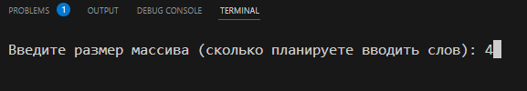
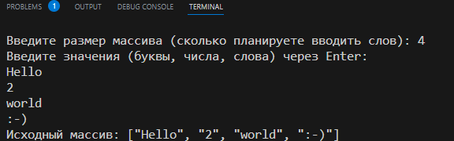
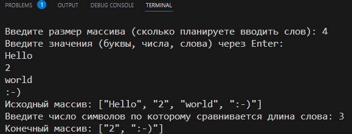

# Итоговая контрольная работа по основному блоку
***
## Зачем был разработан этот проект?
Данная задача была разработана в рамках итоговой контрольной работы по основному блоку обучения в GeekBrains. Это своеобразные срез знаний. К описанной ниже программе также прилагается блок-схема работы программы и вот это описание. 

## 1. Задание
Задача: *Написать программу, которая из имеющегося массива строк формирует новый массив из строк, длина которых меньше, либо равна 3 символам. Первоначальный массив можно ввести с клавиатуры, либо задать на старте выполнения алгоритма. При решении не рекомендуется пользоваться коллекциями, лучше обойтись исключительно массивами.*

>Примеры:
>
>[“Hello”, “2”, “world”, “:-)”] → [“2”, “:-)”]
>
>[“1234”, “1567”, “-2”, “computer science”] → [“-2”]
>
>[“Russia”, “Denmark”, “Kazan”] → []

## 2. Описание

Программа позволяет ввести любое количество слов, чисел, символов и из предложенного массива выбрать только те, которые удовлетворяют критерию отбора. В данном случае критерием отбора является количество символов.

За фразой *любое количество слов* скрывается заранее опредлённый размер массива, который задаёт пользователь при первом запуске программы.

>

Следом следует приглашение ввести слова:

>

Если размер массива выбран 4, то после ввода последнего слова и нажатия Enter на экране появится введённый массив.

Останется только ввести количество символов, по которому будет выполняться проверка длины слова:

>

## 3. Разработка
Разработка программы велась в среде Visual Studio Code — редактор исходного кода, разработанный Microsoft для Windows, Linux и macOS. Позиционируется как «лёгкий» редактор кода для кроссплатформенной разработки веб- и облачных приложений

## 4. Требования
Особых требований к программе не предъявляется. Запускается программа в среде Visual Studio Code 1.79.0 через командную строку командой *dotnet run*.

## FAQ 
1. Программа не открывается.
    >*Ответ: проверьте версию VS Code. Откройте папку с программой через File -> Open Folder..., а также проверьте наличий всех рабочих папок на компьютере скачанных из репозитория GitHub.*
2. Программа всё равно не октывается!
    >*Ответ: проверьте работоспособность программы на GitHub. Если всё в порядке, переходите к п.1.*
3. Программа зависла и не получается ввести значения!
    >*Ответ: в консоле нажмите сочетание клавишь клавиатуры Ctrl+C и снова введите команду dotnet run.*

## Доработка проекта
1. В качестве доработки планируется добавить WinForms.
2. Возможность работать с динамическим массивом.
3. Добавить выбор Random массива вместо ручного ввода.

## Команда проекта

## Источники